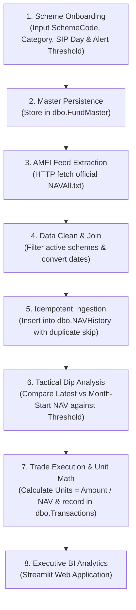

# Mutual Fund Investment Analytics Platform
### Automated NAV Pipeline · Tactical Dip Detection · Portfolio Analytics 
`Python` · `SQL Server (T-SQL)` · `Streamlit` · `Plotly` · `Data Engineering` · `Financial Analytics`

---

## 📌 Project Overview

This project is a comprehensive **Financial Data Engineering and Investment Analytics Case Study** evaluating automated mutual fund tracking, quantitative dip-detection, and portfolio performance analytics. The platform enables retail investors to build wealth systematically across asset classes (large cap, mid cap, small cap, index funds, and commodity ETFs) by eliminating manual portfolio tracking, automating daily Net Asset Value (NAV) ingestion directly from the **Association of Mutual Funds in India (AMFI)**, storing normalized financial time-series data in **Microsoft SQL Server**, and generating objective, rule-based investment decisions.

The analysis addresses a fundamental retail investment question:

> *"How can automated data engineering and rule-based quantitative analytics eliminate manual portfolio tracking—pinpointing tactical dip-buying opportunities while providing transparent, real-time visibility into portfolio valuation and asset allocation?"*

The case study spans the complete financial analytics lifecycle: from building an automated ingestion pipeline that cleans semicolon-delimited AMFI feeds (~15,000 schemes daily) and designing a normalized 3-table relational schema with composite unique constraints, to formulating a month-to-date (MTD) dip-buying decision engine, executing analytical T-SQL queries, and deploying an interactive, browser-based **Streamlit Web Application** featuring full self-service operations (1-click ETL batch execution, live scheme onboarding, and trade entry with automated unit math).

---

## 🎯 Objectives

- **Architect Automated Data Ingestion**: Build a resilient extraction pipeline targeting AMFI's official public NAV feed (`NAVAll.txt`), parsing semicolon-delimited text streams into clean dataframes with automated null handling and date normalization.
- **Design Normalized Relational Warehouse**: Create a normalized SQL Server schema (`MFInvestmentDB`) enforcing primary keys, foreign key constraints, composite unique indexes, and audit timestamps.
- **Ensure Pipeline Idempotency**: Implement duplicate prevention via SQL constraints (`UQ_NAVHistory_Fund_Date`) and Python error trapping, ensuring safe multi-run execution without duplicating historical records.
- **Formulate Tactical Decision Intelligence**: Develop a quantitative recommendation engine comparing current NAV against month-start reference prices against user-defined alert thresholds to generate objective **BUY** or **WAIT** signals.
- **Automate Unit & Cost Basis Math**: Calculate fractional mutual fund units up to 6 decimal places, weighted average purchase price, market valuation, and unrealized profit/loss across all transactions.
- **Deploy Interactive Web Analytics**: Build and deploy an institutional-grade **Streamlit Web Application (`app.py`)** with custom FinTech styling, dynamic ODBC driver detection, demo/offline fallback, and interactive Plotly visualizations.
- **Provide Complete Self-Service Operations**: Allow investors to onboard funds, log transactions, and trigger ETL jobs either through the browser UI or via standalone Python CLI utilities.
- **Document Data Assumptions**: Explicitly state analytical modeling assumptions regarding NAV pricing availability, transaction sequencing, and MTD reference price selection.

---

## 📁 Project Structure

```text
Mutual-Fund-Investment-Analytics/
│
├── README.md                                             # Project documentation & case study summary
│
├── app.py                                                # Streamlit interactive web application (Tabs 1, 2, 3)
│
├── Python/
│   ├── download_nav.py                                   # Reusable AMFI data extraction & parser
│   ├── daily_etl.py                                      # Automated daily batch ETL pipeline with logging
│   ├── register_fund.py                                  # CLI fund onboarding utility
│   ├── register_transaction.py                           # CLI trade registration with automatic unit math
│   ├── read_fundmaster.py                                # SQL query utility for active tracked funds
│   └── sql_connection.py                                 # Database connectivity diagnostic script
│
├── SQL/
│   └── Database.sql                                      # T-SQL DDL script (Schema, Constraints, Indexes)
│
├── requirements.txt                                      # Python package dependencies
├── LICENSE                                               # MIT open-source license
└── .gitignore                                            # Git exclusion rules
```

---

## 🔄 Investment Onboarding & Analytical Journey

The platform executes a structured 8-stage automated investment and analytics workflow:




## 💡 Financial & Product Thinking

### 1. Tactical Dip-Buying Hypothesis
- **Hypothesis**: Retail investors underperform mutual fund benchmarks primarily due to emotional hesitation during market pullbacks and failing to deploy tactical capital during monthly market dips.
- **Reasoning**:
  - **Emotional Friction**: Investors tend to buy during market highs (FOMO) and pause SIPs during short-term corrections.
  - **Information Asymmetry**: Investors rarely know whether today's NAV represents a meaningful dip relative to the current month's opening price.
  - **Discipline Through Automation**: Setting an objective, fund-specific `AlertThreshold` (e.g., `-2.00%`) removes emotional hesitation by generating an automated **`BUY SIGNAL`**.
- **Falsification Criteria**: The hypothesis is disproven if funds bought on dip alerts generate equivalent or lower internal rate of return (IRR) compared to unconditional fixed-day SIP investing over a 12-month horizon.

### 2. North Star & Counter-Metrics
- **North Star Metric**: **Portfolio Value Added Through Tactical Dips (Alpha %)**
  - *Rationale*: Measures the additional percentage return generated by investments made on **`BUY SIGNAL`** days compared to standard monthly SIP benchmark dates.
- **Counter-Metric**: **Cash Drag Rate (% Uninvested Capital Held for Dips)**
  - *Rationale*: Ensures investors do not hold excessive uninvested cash waiting for rare dip triggers, which would compromise long-term compound growth.

### 3. Quantitative Decision Rules
The decision engine calculates month-to-date (MTD) NAV movement against the baseline month-start valuation:

$$\text{Reference NAV} = \text{First Available NAV of Current Month}$$

$$\Delta_{\text{NAV}}\% = \left( \frac{\text{Latest NAV} - \text{Reference NAV}}{\text{Reference NAV}} \right) \times 100$$

$$\text{Recommendation} = \begin{cases} \textbf{BUY SIGNAL}, & \text{if } \Delta_{\text{NAV}}\% \le \text{Alert Threshold} \\ \textbf{WAIT}, & \text{otherwise} \end{cases}$$

*Example*: If **Nippon India Nifty Bank Index Fund** opens July at ₹12.63 and drops to ₹12.32 on July 27, the MTD Change is $-2.44\%$. With an `AlertThreshold` of $-2.00\%$, the condition $-2.44\% \le -2.00\%$ triggers an automated **`✓ BUY SIGNAL`**.

---

## 📊 Streamlit Web Platform Architecture

The platform provides a browser-based analytics interface built in pure Python using Streamlit and Plotly:

### Tab 1: 🎯 Buy Opportunities (Decision Engine)
- **Top FinTech Scorecards**: Valuation Date, Total Monitored Schemes, and Active Buy Opportunities count.
- **Active Buy Signals Banner**: Prominently highlights funds that have breached their monthly dip thresholds with glowing green **`✓ BUY SIGNAL`** badges.
- **Interactive Decision Matrix**: Clean table formatted with rupee amounts, dip percentages, and custom recommendation badges.
- **Plotly Spline Trajectory Chart**:
  - Smooth spline curve interpolation (`shape='spline'`) with area gradient fill (`fill='tozeroy'`).
  - Red dashed month-start reference benchmark line.
  - Dark-glass hover tooltips displaying date, daily NAV, and % dip from reference.


### Tab 2: 📊 Portfolio Performance & Valuation
- **Executive KPI Cards**: Total Capital Invested, Net Portfolio Valuation, Overall Return %, and Total Unrealized P&L.
- **Category Allocation Treemap**: Interactive Plotly treemap visualising portfolio capital distribution with percentage shares.
- **AMC Capital Donut Chart**: Capital split across fund houses (ICICI, Nippon, HDFC, UTI) with central total annotation.
- **Holdings Matrix Table**: Fund-by-fund breakdown displaying units, average cost basis, market value, and conditional profit/loss badges.


### Tab 3: ⚡ Management & Operations Hub
- **1-Click Daily ETL Execution**: Fetches live AMFI NAVs, matches active schemes, and updates SQL Server with live progress bars.
- **Scheme Onboarding Form**: Verifies AMFI scheme codes in real-time, infers the AMC, and inserts new funds into `dbo.FundMaster`.
- **Trade Entry Form**: Logs BUY/SELL orders with automated unit calculations based on execution-date NAV.


---

## 🛠️ Tech Stack & Engineering Competencies

| Domain | Technologies & Libraries | Key Analytical & Engineering Competencies |
|---|---|---|
| **Programming & ETL** | Python 3.14, Pandas, NumPy, Requests | Data extraction, CSV parsing, date standardization, batch loading |
| **Relational Database** | Microsoft SQL Server, T-SQL, PyODBC | Dimensional schema design, composite unique indexing, CTEs, Window functions |
| **Web Application & UI** | Streamlit, HTML5/CSS3, Google Fonts (Inter) | Component design, session caching (`@st.cache_data`), responsive layout |
| **Data Visualization** | Plotly Express, Plotly Graph Objects | Treemaps, Donut charts, spline curves, gradient fills, hover templates |
| **Financial Analytics** | Quantitative Logic, Unit Accounting | Month-to-Date dip detection, fractional unit math, weighted average cost basis |

---
